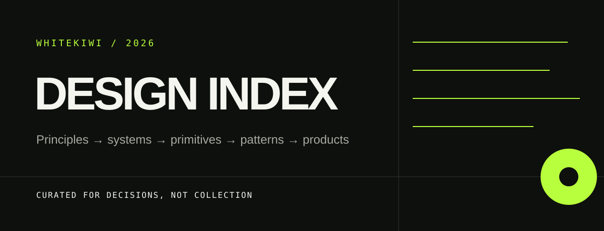

<p align="center">
  
</p>

<p align="center">
  A decision-oriented field guide to interface design—not a bookmark dump.
</p>

<p align="center">
  <a href="https://github.com/WhiteKiwi/design-index/actions/workflows/links.yml"></a>
  <a href="LICENSE"></a>
  <a href="CONTRIBUTING.md"></a>
</p>

Design Index records **what a reference is good for, what not to copy, and what must be verified before adoption**. It connects visual theory to production decisions across accessibility, design systems, component behavior, motion, data UI, portfolios, and AI-assisted workflows.

## Find the right lane

| If you need to… | Start here | What you will get |
| --- | --- | --- |
| explain why a decision is sound | [Theory & foundations](references/theory.md) | hierarchy, color, accessibility, motion, responsive rules |
| structure tokens and governance | [Design systems](references/design-systems.md) | systems worth studying and the exact lesson from each |
| choose an implementation base | [Components & primitives](references/component-libraries.md) | behavior libraries, open-code catalogs, motion, and data UI |
| inspect real product flows | [Product flows & inspiration](references/product-flows-and-inspiration.md) | shipped patterns separated from visual galleries |
| study strong personal sites | [Portfolios](references/portfolios.md) | evidence, editorial pacing, identity, and interaction craft |
| improve an AI design loop | [Tools & workflows](references/tools-and-workflows.md) | contracts, taste controls, review language, and QA loops |
| evaluate before copying | [Adoption checklist](references/adoption-checklist.md) | provenance, license, engineering, behavior, and release gates |
| understand this repository | [Indexes & curation](references/indexes-and-curation.md) | patterns borrowed from successful public indexes |

## How this index thinks

```text
Principle → System → Primitive → Component → Pattern → Product
     why       rules       behavior      unit       composition   context
```

- **Principles** explain perception, hierarchy, accessibility, motion, and responsive behavior.
- **Systems** translate principles into tokens, states, themes, and governance.
- **Primitives** solve difficult behavior such as focus management and disclosure.
- **Components and patterns** are implementation references—not design authority.
- **Product context** decides what survives. Fashion never outranks clarity.

## Reference tiers

| Mark | Meaning | Expected use |
| --- | --- | --- |
| **Foundation** | authoritative standard, research, or durable system | use to justify a decision |
| **Implementation** | maintained primitive, library, or tool | prototype, inspect, and adapt |
| **Inspiration** | gallery, portfolio, or expressive catalog | extract one idea; never inherit authority |

The machine-readable [reference catalog](data/references.yml) is a maintained shortlist, while the guides provide broader research and decision context.

## Current shortlist

| Reference | Best used for | Stance |
| --- | --- | --- |
| [SEED Design](https://seed-design.io/) | semantic tokens and product-scale foundations | foundation |
| [GOV.UK Design System](https://design-system.service.gov.uk/) | research-backed patterns and public contribution governance | foundation |
| [Base UI](https://base-ui.com/react/overview/about) | accessible unstyled React behavior | implementation |
| [React Aria Components](https://react-aria.adobe.com/) | accessible, internationalized behavior with composable styling | implementation |
| [shadcn/ui](https://ui.shadcn.com/) | open-code component ownership | implementation; adapt deliberately |
| [Motion Primitives](https://motion-primitives.com/) | focused, inspectable motion patterns | implementation; use sparingly |
| [Mobbin](https://mobbin.com/) | real product screens and end-to-end flows | inspiration with product context |
| [Recent (formerly Godly)](https://recent.design/) | expressive web art direction | inspiration only |

## Curation contract

1. Prefer official documentation and canonical source repositories.
2. Say **why it belongs** and name the useful idea precisely.
3. Record a limit, risk, or condition; no source is universally adoptable.
4. Keep one primary category per entry and reject duplicates.
5. Verify licenses, dependencies, semantics, keyboard use, focus, responsive behavior, and reduced motion before adoption.
6. Separate `reference`, `candidate`, `approved`, and `implemented`.
7. Remove stale entries when their remaining historical value is not explicit.

See [CONTRIBUTING.md](CONTRIBUTING.md) for acceptance criteria and the pull-request checklist.

## Repository map

```text
assets/       README and documentation artwork
data/         machine-readable curated shortlist
references/   human-readable research and decision guides
scripts/      deterministic catalog validation
.github/      contribution forms and quality automation
```

The catalog records `last_verified` because component sites, licenses, pricing, and APIs change. Weekly automation validates Markdown links; every change also validates catalog shape, duplicate IDs, URLs, categories, and states.

## Origin

This index grew out of the research behind [WhiteKiwi Portfolio](https://portfolio.whitekiwi.link/) and [PIP Design System](https://design.whitekiwi.link/). It remains product-agnostic so the same judgment can be reused elsewhere.

## License

The writing and repository structure are released under the [MIT License](LICENSE). Linked projects retain their own licenses and terms.
